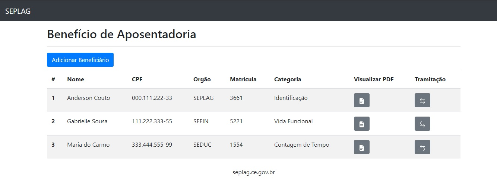
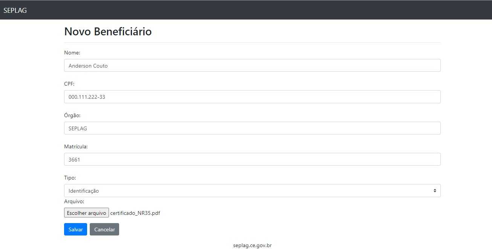
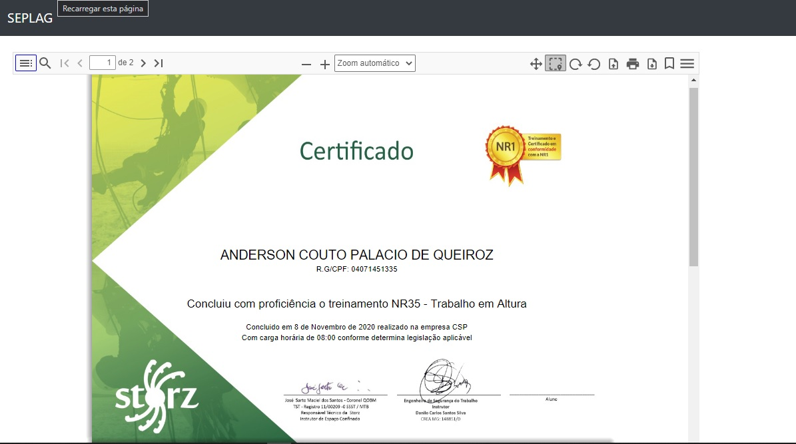
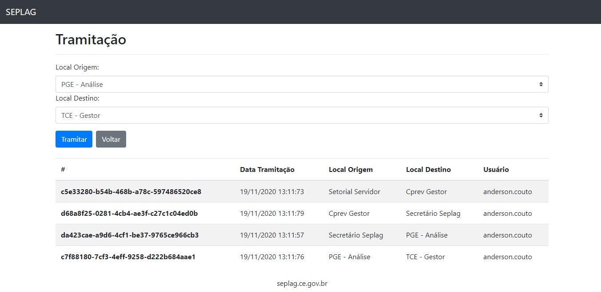

# Beneficios de Aposentadoria SEPLAG-CE

Esta aplicação simula a criação de diferentes tipos de benefícios de aposentadoria para servidores públicos.
É possivel anexar documentos e tramitar o processo para outros setores.

Esse projeto foi gerado com [Angular CLI](https://github.com/angular/angular-cli) versão 11.0.1.

## Como Executar

Execute o comando `ng serve` e navegue (preferencialmente com o Google Chrome) em `http://localhost:4200/`.

## Armazenamento de Dados

Para fins de simplificação, foi utilizado o `Local Storage` do próprio navegador como simulação de base de dados.

## Imagens

Tela de listagem de beneficiários:

Tela de cadastro de beneficiários:

Tela de visualização do documento PDF:

Tela processamento e visualização de tramitações:

